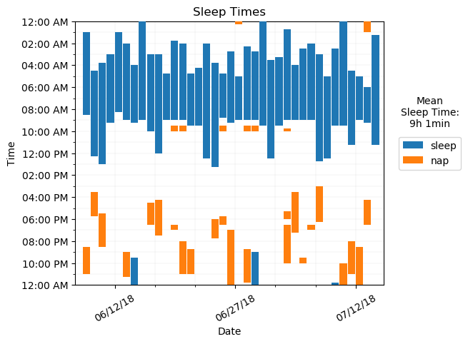

# Sleep Graph Generator

Generates plot of sleep data for data visualization.

## Usage

```
Usage: plot.py [OPTIONS] JSON_FILE

  Given a JSON file containing sleep data, generate plots analyzing the
  data. The JSON file can be generated from an org file.

Options:
  -d, --output-dir PATH  Path to output directory.
  -o, --org-file PATH    Path to org file with sleep data. If this option is
                         provided, a JSON file with the name `JSON_FILE' will
                         be generated and used. If this option is not
                         provided, data will be read from `JSON_FILE'.
  --help                 Show this message and exit.
```

Two file formats containing the data are accepted: `json` and `org`.

### `json`

To generate the plots with `json` data, run

```bash
python plot.py foo.json
```

where `foo.json` contains data in the following format.

```json
{
  "sleep": [
    {
      "start": "07/07/2017 22:30",
      "end": "07/08/2017 07:00"
    },
    {
      "start": "07/08/2017 22:45",
      "end": "07/09/2017 07:30"
    }
  ],
  "nap": [
    {
      "start": "07/08/2017 15:00",
      "end": "07/08/2017 15:15"
    }
  ]
}
```

Intervals in `sleep` will be plotted in one color and intervals in `nap` will
be plotted in another color.

### `org`

`org` data can also be used to generate plots. This is done by converting the
`org` data into the correct `json` format then using the `json` data to
generate the plots. To generate the plots with `org` data, run

```bash
python plot.py foo.json --org-file foo.org
```

where `foo.json` is the name of the `json` file the data gets output to and
`foo.org` contains data in the following format.

```
* Jul 7, 2017
  - foo
  - sleep 10:30 pm - 7:00 am
  - bar

* Jul 8, 2017
  - foobar
  - nap 3:00 pm - 3:15 pm
  - sleep 10:45 pm - 7:30 am
```

Lines that are not headlines and do not contain the word `sleep` or `nap` will
be ignored.

## Output

Sample data is provided in the `example` directory.

```bash
python plot.py sample-data.json --org-file sample-data.org
```


